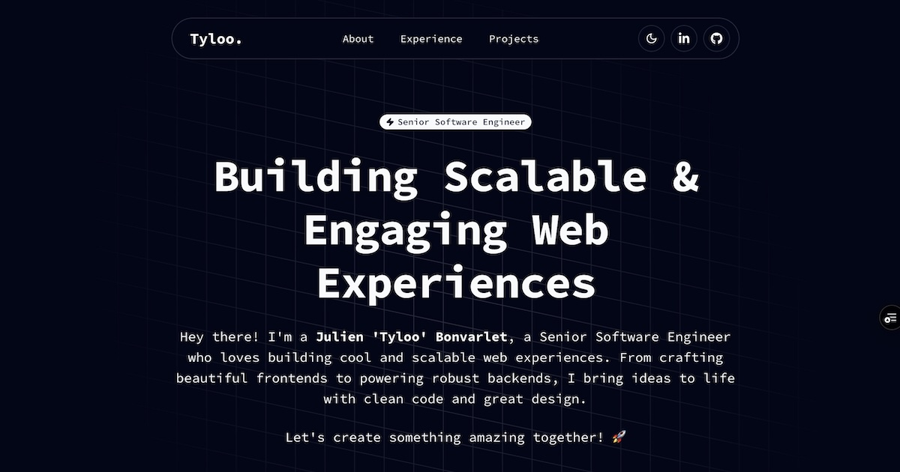

# tyloo.fr

A modern, responsive portfolio website built with Next.js 16, React 19, and Tailwind CSS 4. Features smooth animations, dark mode support, and a clean monospace design aesthetic.

[](https://github.com/tyloo/tyloo.fr/actions/workflows/ci.yml)
[](https://opensource.org/licenses/MIT)

**Live Demo:** [https://tyloo.fr](https://tyloo.fr)



## Features

- **Responsive Design** — Mobile-first approach with seamless adaptation across all devices
- **Dark/Light Mode** — System preference detection with manual toggle
- **Smooth Animations** — Powered by Motion (Framer Motion) for fluid transitions
- **Interactive Hero** — Animated grid background with rotating typewriter text effect
- **Experience Timeline** — Visual career journey with detailed role descriptions
- **Project Showcase** — Grid layout with project cards, tech badges, and live links
- **Active Section Tracking** — Smart navbar highlighting based on scroll position
- **SEO Optimized** — Full metadata, Open Graph, and Twitter card support
- **Analytics Ready** — Vercel Analytics integration included

## Tech Stack

| Category | Technologies |
|----------|-------------|
| Framework | Next.js 16, React 19, TypeScript |
| Styling | Tailwind CSS 4, CSS Custom Properties (OKLch) |
| Animation | Motion, Tailwind CSS Animate |
| UI Components | Radix UI, Shadcn/UI patterns |
| Icons | Lucide React, React Icons |
| Theme | next-themes |
| Code Quality | Biome (linting & formatting) |
| Analytics | Vercel Analytics |

## Getting Started

### Prerequisites

- Node.js 18+
- pnpm (recommended) or npm/yarn

### Installation

```bash
# Clone the repository
git clone https://github.com/tyloo/tyloo.fr.git
cd tyloo.fr

# Install dependencies
pnpm install

# Start development server
pnpm dev
```

Open [http://localhost:3000](http://localhost:3000) to view the site.

### Available Scripts

| Command | Description |
|---------|-------------|
| `pnpm dev` | Start development server |
| `pnpm build` | Build for production |
| `pnpm start` | Start production server |
| `pnpm lint` | Run Biome linter |
| `pnpm format` | Format code with Biome |
| `pnpm type-check` | Run TypeScript type checking |

## Project Structure

```
tyloo.fr/
├── app/
│   ├── layout.tsx          # Root layout with providers
│   ├── page.tsx            # Main page sections
│   └── globals.css         # Global styles & theme variables
├── components/
│   ├── hero.tsx            # Hero section with animations
│   ├── about.tsx           # About section
│   ├── experience.tsx      # Career timeline
│   ├── projects.tsx        # Project showcase grid
│   ├── navbar.tsx          # Navigation with scroll tracking
│   ├── footer.tsx          # Footer component
│   └── ui/                 # Reusable UI components
├── lib/
│   ├── projects.ts         # Project data
│   ├── experiences.ts      # Experience data
│   ├── socials.ts          # Social links
│   └── utils.ts            # Utility functions
└── public/
    ├── projects/           # Project images
    └── ...                 # Favicons, OG images, resume
```

## Customization

To use this portfolio as a template for your own site:

1. **Update personal info** in `app/layout.tsx` (metadata, title, description)
2. **Replace content** in `lib/experiences.ts` and `lib/projects.ts`
3. **Swap images** in `public/` directory (profile photo, project screenshots, resume)
4. **Modify colors** in `app/globals.css` (CSS custom properties)
5. **Update social links** in `lib/socials.ts`

## Deployment

### Vercel (Recommended)

[](https://vercel.com/new/clone?repository-url=https://github.com/tyloo/tyloo.fr)

### Other Platforms

```bash
# Build the production bundle
pnpm build

# Start the production server
pnpm start
```

The build output can be deployed to any Node.js hosting platform or exported as static files.

## Contributing

Contributions are welcome! Please feel free to submit a Pull Request.

1. Fork the repository
2. Create your feature branch (`git checkout -b feature/amazing-feature`)
3. Commit your changes (`git commit -m 'Add amazing feature'`)
4. Push to the branch (`git push origin feature/amazing-feature`)
5. Open a Pull Request

## License

This project is licensed under the MIT License - see the [LICENSE](LICENSE) file for details.

## Author

**Julien 'Tyloo' Bonvarlet**

- Website: [tyloo.fr](https://tyloo.fr)
- GitHub: [@tyloo](https://github.com/tyloo)
- LinkedIn: [julien-bonvarlet](https://linkedin.com/in/julien-bonvarlet)
